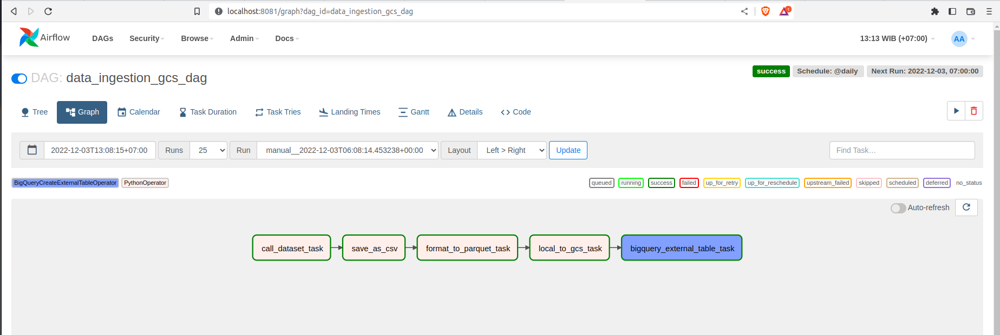

### Concepts

 [Airflow Concepts and Architecture](docs/1_concepts.md)

### Workflow

 
 
### Setup - Official Version
 (For the section on the Custom/Lightweight setup, scroll down)

 #### Setup
  [Airflow Setup with Docker, through official guidelines](1_setup_official.md)

 #### Execution
 
  1. Build the image (only first-time, or when there's any change in the `Dockerfile`, takes ~15 mins for the first-time):
     ```shell
     docker-compose build
     ```
   
     or (for legacy versions)
   
     ```shell
     docker build .
     ```

 2. Initialize the Airflow scheduler, DB, and other config
    ```shell
    docker-compose up airflow-init
    ```

 3. Kick up the all the services from the container:
    ```shell
    docker-compose up
    ```

 4. In another terminal, run `docker-compose ps` to see which containers are up & running (there should be 7, matching with the services in your docker-compose file).

 5. Login to Airflow web UI on `localhost:8080` with default creds: `airflow/airflow`

 6. Run your DAG on the Web Console.

 7. On finishing your run or to shut down the container/s:
    ```shell
    docker-compose down
    ```

    To stop and delete containers, delete volumes with database data, and download images, run:
    ```
    docker-compose down --volumes --rmi all
    ```

    or
    ```
    docker-compose down --volumes --remove-orphans
    ```
       
### Setup - Custom No-Frills Version (Lightweight)
This is a quick, simple & less memory-intensive setup of Airflow that works on a LocalExecutor.

  #### Setup
  [Airflow Setup with Docker, customized](2_setup_nofrills.md)

  #### Execution
  
  1. Stop and delete containers, delete volumes with database data, & downloaded images (from the previous setup):
    ```
    docker-compose down --volumes --rmi all
    ```

   or
    ```
    docker-compose down --volumes --remove-orphans
    ```
    
   Or, if you need to clear your system of any pre-cached Docker issues:
    ```
    docker system prune
    ```
    
   Also, empty the airflow `logs` directory.
    
  2. Build the image (only first-time, or when there's any change in the `Dockerfile`):
  Takes ~5-10 mins for the first-time
    ```shell
    docker-compose build
    ```
    or (for legacy versions)
    ```shell
    docker build .
    ```

  3. Kick up the all the services from the container (no need to specially initialize):
    ```shell
    docker-compose -f docker-compose-nofrills.yml up
    ```

  4. In another terminal, run `docker ps` to see which containers are up & running (there should be 3, matching with the services in your docker-compose file).

  5. Login to Airflow web UI on `localhost:8080` with creds: `admin/admin` (explicit creation of admin user was required)

  6. Run your DAG on the Web Console.

  7. On finishing your run or to shut down the container/s:
    ```shell
    docker-compose down
    ```
    
### Setup - Taken from DE Zoomcamp 2.3.4 - Optional: Lightweight Local Setup for Airflow

Use the docker-compose_2.3.4.yaml file (and rename it to docker-compose.yaml). Don't forget to replace the variables `GCP_PROJECT_ID` and `GCP_GCS_BUCKET`.

### Future Enhancements
* Deploy self-hosted Airflow setup on Kubernetes cluster, or use a Managed Airflow (Cloud Composer) service by GCP

### References
For more info, check out these official docs:
   * https://airflow.apache.org/docs/apache-airflow/stable/start/docker.html
   * https://airflow.apache.org/docs/docker-stack/build.html
   * https://airflow.apache.org/docs/docker-stack/recipes.html

# 02-airflow-gcs-bigquery-pipeline
